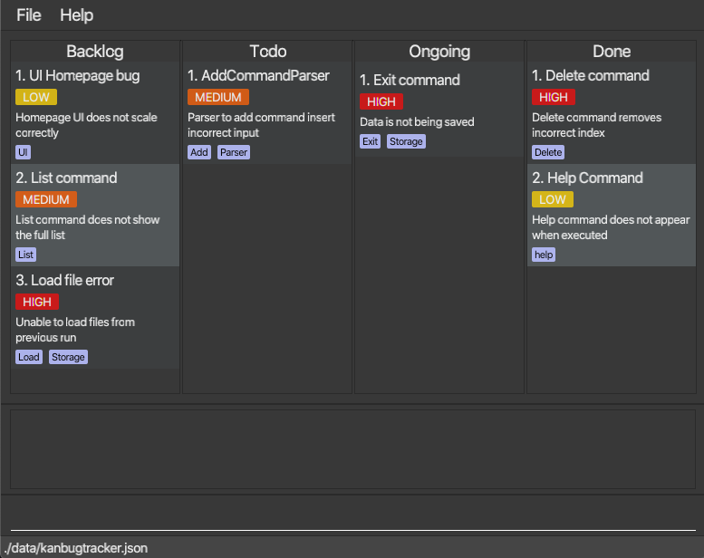

* The KanBug Tracker is a **desktop application for managing the tracking of bugs you encounter, optimised for use via a Command Line Interface** (CLI) while still having the benefits of a Graphical User Interface (GUI).  
  Example usages:
  * management of bugs encountered during a self-initiated project 
  * documenting the bug fixing process by being able to add descriptions to and modifying the status of different bugs
* The project was built using software engineering best practices that governed how the code was written and how the project was managed.
  * It is **written in OOP fashion**.
  * It comes with a **reasonable level of user and developer documentation**.
  * Project was managed using a **forking workflow**.
* It is named `KanBug Tracker` because the product makes use of the concept of a **Kanban board**, an agile project management tool, for the visualisation of different bugs the user encounters.
* For the detailed documentation of this project, see the **[KanBug Tracker Product Website](https://ay2021s1-cs2103t-w17-1.github.io/tp/)**.
* This project is based on the AddressBook-Level3 project created by the [SE-EDU initiative](https://se-education.org).

Team Name: AY2021S1-CS2103T-W17-1
